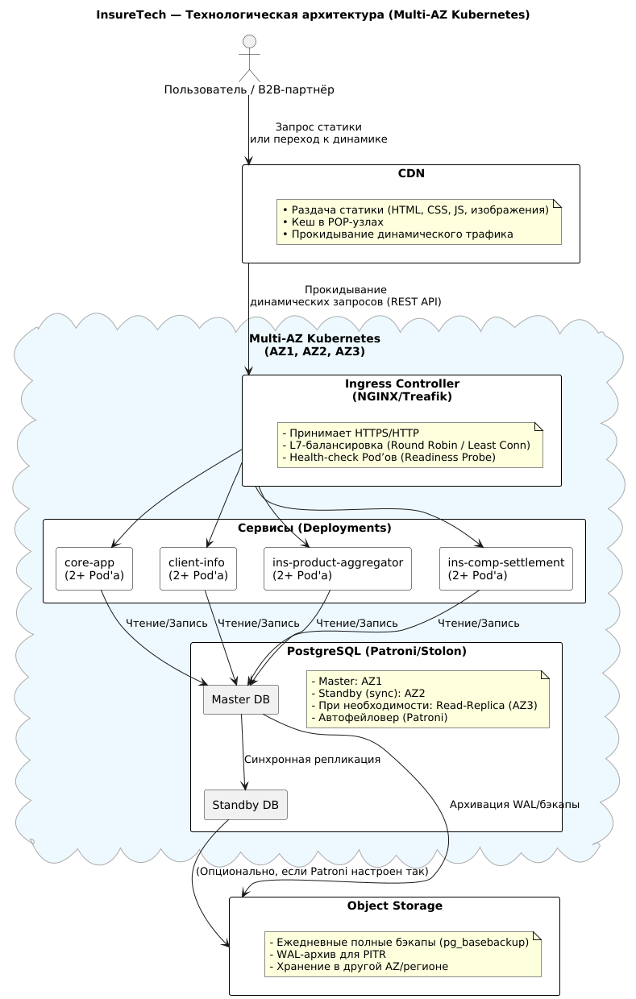

# Задание 1. Проектирование технологической архитектуры

Компания хочет сделать упор на развитие в регионах РФ. Планируется значительный рост количества пользователей и
запросов. 
Нужно обеспечить бесперебойную работу сервиса 24/7, при этом сервис должен обслуживать клиентов из всех часовых поясов.
Требования к отказоустойчивости системы крайне высокие: 
- RTO — 45 мин., RPO — 15 мин. 
- Согласно требованиям бизнеса, доступность приложения должна быть равна 99,9%.
Дополнительно к этому нужно обеспечить одинаковое время загрузки страниц для пользователей из разных регионов. Оно не
должно зависеть от географического местоположения пользователя.

На текущий момент сервис хранит ограниченный набор данных, который включает в себя:
- базовую информацию о клиентах — ФИО, контакты, документы,
- информацию о продуктах и тарифах,
- историю заявок клиентов.
- Общий объём данных, которые хранятся в системе, равен 50 GB.

---

## 1. Развёртывание в Kubernetes (один растянутый кластер)

- **Выбор**: используется один «растянутый» (Multi-AZ) Kubernetes-кластер вместо нескольких независимых в разных
  регионах.
- **Обоснование**:
    1. Текущие объёмы данных (около 50 GB) и зафиксированные RPS не требуют полноценного мультикластерного развёртывания
       по всей РФ.
    2. Один кластер в нескольких зонах доступности (AZ) обеспечивает отказоустойчивость на уровне инфраструктуры,
       упрощая DevOps-процессы (единый CI/CD, мониторинг).
    3. Это решение покрывает требуемую доступность 99,9% и позволяет масштабироваться по мере роста.

---

## 2. Балансировка нагрузки

- **Подход**: разделять статический (через CDN) и динамический трафик (через Kubernetes Ingress).
- **Обоснование**:
    1. **CDN** (с POP-узлами по всей РФ) ускоряет отдачу статического контента, снижая задержки для географически
       распределённых пользователей.
    2. **Ingress** (L7-балансировщик) внутри кластера распределяет динамические запросы между Pod’ами каждого сервиса (
       core-app, client-info и др.).
    3. Все сервисы имеют **health-check** (Liveness/Readiness Probes) для автоматического исключения «неработоспособных»
       Pod’ов.

---

## 3. Фейловер-стратегия (RTO=45 мин, RPO=15 мин)

- **На уровне Kubernetes**:
    - При сбое ноды или целой AZ Pod’ы пересоздаются в рабочих зонах, а балансировщик автоматически «выключает»
      недоступные Pod’ы.
- **На уровне БД**:
    - Используется HA-конфигурация PostgreSQL (Master + синхронная реплика) с фреймворком Patroni (или аналог).
    - При падении мастера синхронная реплика в другом AZ становится новым мастером автоматически (failover), что
      закрывает окно недоступности записи в считаные секунды/минуты.
- **Соответствие RTO/RPO**:
    - Авто-переключение БД и пересоздание Pod’ов обычно уложатся намного быстрее 45 мин.
    - Потери данных (RPO) фактически стремятся к 0 из-за синхронной репликации.

---

## 4. Конфигурация базы данных и резервное копирование

- **Синхронная репликация**: мастер (AZ1) и standby (AZ2) + опциональные асинхронные реплики для чтения (если нагрузка
  вырастет).
- **Резервное копирование**: ежедневные полные бэкапы (pg_basebackup) + непрерывное архивирование WAL в Object Storage,
  обеспечивая возможность Point-In-Time Recovery (PITR).
- **Шардирование**: не применяется на данном этапе (50 GB и умеренные RPS), так как вертикальное и реплицированное
  масштабирование PostgreSQL пока достаточно.

---

## 5. Итог и выгоды

1. **Отказоустойчивость**: сервис продолжает работу при падении Pod’а, ноды или целой AZ.
2. **Геораспределение**: CDN обеспечивает быструю раздачу статики по всей РФ, минимизируя задержку для пользователей.
3. **Простота управления**: единый Kubernetes-кластер, единая БД (master + replica), автоматический фейловер.
4. **Соответствие бизнес-требованиям**: RTO=45 мин, RPO=15 мин, 99,9% доступности.
5. **Гибкость для роста**: по мере увеличения запросов можно наращивать Pod’ы в кластере (горизонтальное
   масштабирование) и/или переходить к шардингу БД, если объёмы станут слишком велики.

Таким образом, предложенная архитектура сочетает в себе **достаточную надёжность, гибкость и простоту**, закрывая
ключевые требования InsureTech и оставляя пути для дальнейшего масштабирования.

## 6. Схема "InureTech_технологическая архитектура_to-be"

