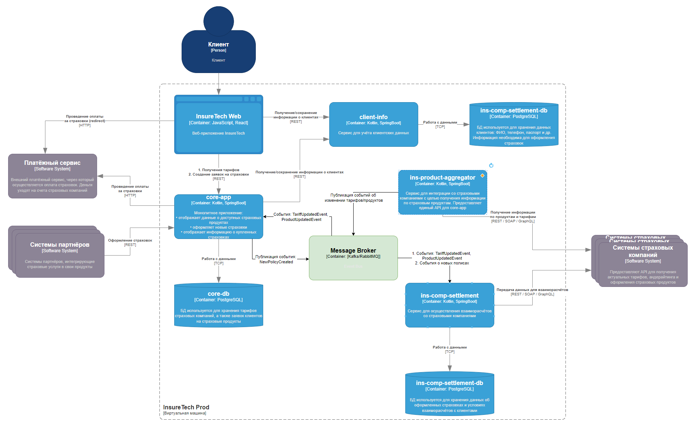

# Задание 3. Переход на Event-Driven архитектуру

---

> Проанализируйте текущую архитектуру. Создайте текстовый документ и напишите там список проблем и рисков, которые
> связаны с планируемым ростом нагрузки.

Ниже перечислены основные проблемы и риски, которые становятся особенно критичными при увеличении числа страховых
компаний и общего потока запросов:

1. **Синхронные вызовы и зависимость от внешних сервисов**
    - Сервис `ins-product-aggregator` по каждому запросу опрашивает все внешние системы страховых компаний в реальном
      времени. При увеличении числа компаний (например, с 5 до 10) суммарное время ожидания и вероятность ошибки
      возрастут.
    - Невозможность ответить на запрос (или слишком долгий ответ) от одной страховой компании замедляет ответ всему
      запросу в целом.

2. **Хранение «локальных реплик» с задержкой**
    - `core-app` обновляет данные раз в 15 минут, а `ins-comp-settlement` — раз в сутки. При росте числа тарифов и
      продуктов эти данные могут быстро устаревать (особенно, если компании динамически меняют условия).
    - Слишком редко обновляемые реплики приводят к расхождению данных при оформлении полисов и к потенциальным ошибкам в
      тарифах (особенно важным это становится при росте объёмов продаж).

3. **Узкое место и потенциальная перегрузка `ins-product-aggregator`**
    - При высокой нагрузке (большее число клиентов, страховых продуктов, компаний) сервис-агрегатор может стать узким
      местом, так как обрабатывает все входящие запросы о продуктах и тарифах.
    - Отсутствие механизма масштабирования или балансировки нагрузки (на схеме не показаны). Если к агрегатору
      одновременно поступит большое число запросов, он будет либо сильно нагружен, либо не сможет вернуть результат
      вовремя.

4. **Зависимость рабочих процессов от доступности сервисов в режиме реального времени**
    - Любая ошибка взаимодействия (внешние API не отвечают, таймаут, сетевые проблемы) напрямую влияет на работу
      `core-app` и `ins-comp-settlement`.
    - При увеличении количества партнёров растёт и вероятность возникновения таких ошибок.

5. **Сложность и риск задержек при ночной обработке в `ins-comp-settlement`**
    - `ins-comp-settlement` раз в сутки тянет данные (и из `ins-product-aggregator`, и из `core-app`), причём также
      синхронно. Если в этот момент сервис-агрегатор или `core-app` недоступны или работают медленно, это «ломает» всю
      ночную партионную обработку.
    - При расширении списка компаний эта ночь может «растянуться», и расчётные процессы могут не успевать выполняться в
      заданные окна.

6. **Отсутствие единой шины сообщений или шины событий (event bus)**
    - Из описания следует, что взаимодействие ведётся в основном через REST-сервисы, что усиливает синхронность и
      увеличивает взаимозависимости.
    - При расширении экосистемы (новые сервисы, новые бизнес-фичи) становится сложно управлять обменом сообщениями,
      гарантировать доставку и реагировать на события в реальном времени.

7. **Потенциальная неконсистентность данных**
    - Данные о полисах, клиентах, тарифах хранятся в разных базах (`core-db`, `ins-comp-settlement-db`) и
      синхронизируются по расписанию. В случае увеличения потока транзакций и изменения тарифов в реальном времени
      возрастает риск, что данные «разъедутся» (например, клиент купит полис по устаревшей цене).
    - Нет унифицированного механизма оповещения об изменениях тарифов и продуктов — всё делается вызовами к
      `ins-product-aggregator`.

8. **Отсутствие чётких механизмов отказоустойчивости**
    - Из архитектуры не видно паттернов для повышения отказоустойчивости (circuit breaker, retry, dead-letter queue и
      т.п.). Всё завязано на цепочку REST-запросов, где сбой одного узла тянет сбой других.
    - При росте нагрузки эти сбои и задержки будут происходить чаще, что критично скажется на бизнес-процессах (
      например, клиенты не смогут оформить страховку).

Таким образом, текущее решение, основанное на периодической синхронизации и синхронном REST-взаимодействии, уже
испытывает проблемы с задержками и сбоями и будет только сложнее масштабироваться при росте числа страховых компаний и
объёма транзакций.

--- 

> Обновите диаграмму контейнеров InsureTech, предложив решения для выявленных вами рисков и проблем. При этом:
> Не меняя декомпозицию функциональности между сервисами, подумайте, какие взаимодействия стоит переделать на
> Event-Streaming.
> Решите, будете ли вы использовать паттерн Transactional Outbox.

## 1. Общая идея перехода к event-driven взаимодействию

Вместо того, чтобы каждый потребитель (например, `core-app` или `ins-comp-settlement`) периодически «тянул» данные по
REST, можно организовать **подписку** на события об обновлении продуктов и тарифов. Централизованную роль сборщика и
валидатора данных по страховым компаниям продолжит играть `ins-product-aggregator`, но:

1. `ins-product-aggregator` **регулярно** (или по какому-то триггеру) опрашивает внешние страховые компании, обновляет у
   себя информацию и **публикует события** (`ProductUpdatedEvent`, `TariffUpdatedEvent` и т.д.) через брокер сообщений (
   Kafka / RabbitMQ / другое).
2. Сервисы, которые нуждаются в последних данных (прежде всего, `core-app`, а также `ins-comp-settlement`), *
   *подписываются** на эти события и **асинхронно** обновляют собственные локальные копии (кэши) продуктов, тарифов и
   условий оформления.
3. Таким образом, вместо двух жёстко связанных REST-вызовов («раз в 15 минут» и «раз в сутки») появляется **постоянная
   синхронность** данных за счёт потока событий. При увеличении количества страховых компаний и продуктов такой подход
   масштабируется лучше, чем «опрос всех в реальном времени».

### Ключевые выгоды такого подхода

- Избегаем длинных цепочек синхронных REST-запросов при каждом запросе тарифа.
- Сокращаем риск тормозов и ошибок из-за недоступности внешних систем в момент запроса: информация о продуктах уже
  хранится локально и обновляется по событиям.
- Упрощаем масштабирование: каждый новый сервис или компания становится издателем/подписчиком событий, не ломая текущие
  сервисы.

## 2. Какие взаимодействия перевести на Event-Streaming

1. **`ins-product-aggregator` → `core-app`**
    - Вместо периодического GET-запроса «Дай последние тарифы/продукты», `ins-product-aggregator` публикует событие
      «Обновлены тарифы» (или набор событий по каждому продукту).
    - `core-app` подписывается на эти события и обновляет свою локальную базу (через отдельную таблицу или кэш).
    - При оформлении страховки `core-app` опирается на «почти» актуальные данные, которые у него в локальном хранении.

2. **`ins-product-aggregator` → `ins-comp-settlement`**
    - Аналогичный механизм. Вместо ночного запроса «Дай актуальные тарифы», `ins-comp-settlement` всегда получает нужные
      изменения по мере их появления и обновляет свои внутренние структуры данных.
    - Ночная пакетная обработка (если она нужна для бухгалтерии/реестров) может основываться уже на локально накопленных
      данных без долгих REST-вызовов.

3. **`core-app` → `ins-comp-settlement`** (данные о новых оформленных страховках)
    - Вместо того чтобы `ins-comp-settlement` «раз в сутки» делать GET-запрос к `core-app`, можно публиковать события
      «Оформлена новая страховка» (или «Полис аннулирован/дорасчёт и т.д.»).
    - `ins-comp-settlement` сразу знает о каждой оформленной страховке и может сохранять эти данные у себя (в
      `ins-comp-settlement-db`). Тогда ночной процесс перестаёт быть критичным: все данные уже есть, остаётся лишь
      выполнить расчёт и сгенерировать отчёты.

При этом **возможно оставить** некоторые синхронные REST-методы для «точечных» запросов (например, если `core-app` хочет
уточнить детали конкретного тарифа в реальном времени). Однако основная синхронизация, особенно массовая, должна идти
через событие.

## 3. Использование паттерна Transactional Outbox

**Transactional Outbox** нужен там, где мы хотим гарантированно отправлять события о произошедших изменениях **в одной
транзакции** с записью в базу данных. Это актуально в случаях:

- Сервис (например, `ins-product-aggregator` или `core-app`) **обновляет** свою БД (вставляет/изменяет/удаляет записи о
  продуктах, тарифах, оформленных полисах).
- Необходимо **опубликовать** событие «Тариф обновлён» или «Полис оформлен» в **тот же момент**, чтобы не было
  расхождений (когда в базе уже запись есть, а событие из брокера ещё не вышло, или вышло с ошибкой).

### Как это сделать технически

1. **В основной БД** (скажем, `aggregator-db` у `ins-product-aggregator`, либо `core-db` у `core-app`) создаётся
   специальная «outbox»-таблица, куда в рамках **той же транзакции**, что и основная операция, пишется «заглушка»
   события.
2. Отдельный поток/процесс (Event Relay) **регулярно читает** (pull) эти «заглушки» из outbox-таблицы, публикует
   «настоящие» события в брокер сообщений (Kafka / RabbitMQ) и помечает их как отправленные.
3. Таким образом, если основной insert/update в БД произошёл, то событие точно будет доставлено, а если транзакция
   откатилась, то событие не уйдёт в брокер.

С учётом того, что мы не меняем «декомпозицию», а только переделываем некоторые взаимодействия на событие, *
*Transactional Outbox** будет полезен как минимум в:

- `ins-product-aggregator` (когда новые данные о тарифах и продуктах поступают от компаний и записываются к нам).
- `core-app` (когда оформляются новые страховки, и мы должны опубликовать событие о том, что полис создан).

**Рекомендуется** внедрить этот паттерн, чтобы исключить ситуации, когда «данные в таблицах уже есть», а в событии могут
потеряться из-за сбоя интеграции с брокером.

## 4. Итоговое резюме

- **Перевод части взаимодействий на Event-Driven/Streaming** решает основную проблему масштабирования и уменьшает риск
  «пробок» при опросе большого числа страховых компаний.
- **Transactional Outbox** целесообразно использовать там, где крайне важно гарантированно публиковать событие об
  изменении данных (в `ins-product-aggregator` при обновлении тарифов, в `core-app` при создании новых полисов).
- Ночной «батч» в `ins-comp-settlement` можно оставить для итоговых расчётов или формирования реестров, но он уже не
  будет зависеть от больших синхронных REST-вызовов — все данные будут «капать» в течение дня по событию.
- Сервисы, оставшиеся на REST, могут быть дополнены паттернами отказоустойчивости (Circuit Breaker и т.д.) и умным
  кэшированием.

Таким образом, мы сохраняем общую логику сервиса-агрегатора (`ins-product-aggregator`), сервиса ядра (`core-app`) и
сервиса расчётов (`ins-comp-settlement`), но «переворачиваем» схему взаимодействия на подписку на события, избавляясь от
множества проблем синхронных REST-запросов и улучшая масштабирование.

## Обновленная диаграмма контейнеров InsureTech

- Добавили «Message Broker» в центр схемы для организации event-driven взаимодействий.
- Заменили периодические REST-запросы (core-app → aggregator, settlement → aggregator, settlement → core-app) на
публикацию и подписку на события.

---