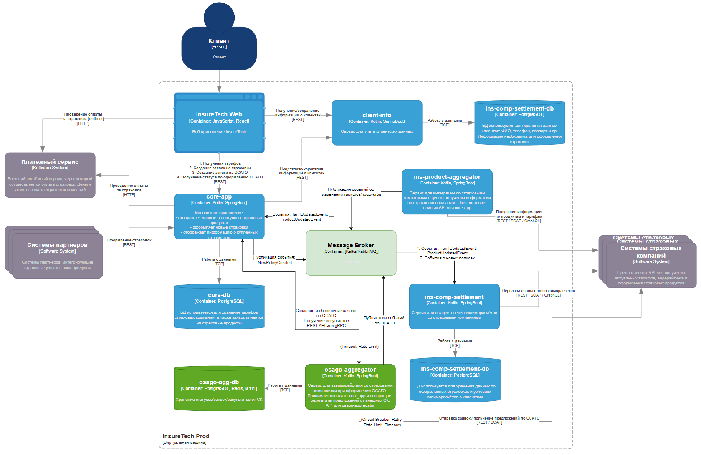

[назад](../README.md)

>Проработайте реализацию osago-aggregator. Решите:
Требуется ли ему своё хранилище данных?
Какой API он предоставляет core-app?
Определите средство интеграции между сервисами core-app и osago-aggregator.
Подумайте над API для веб-приложения в core-app.
Определите средство интеграции между веб-приложением и core-app. Если будете использовать средство, отличное от REST, отразите интеграцию новой стрелкой.
В зависимости от выбранных средств интеграции подумайте, требуется ли где-то применение паттернов отказоустойчивости:
Rate Limiting,
Circuit Breaker,
Retry,
Timeout.
Отобразите применение паттернов на схеме с помощью обозначений из этой библиотеки.
Примите во внимание, что сервисы задеплоены в нескольких экземплярах. Подумайте, зависит ли ваше решение от этого.

---

## 1. Нуждается ли osago-aggregator в собственном хранилище данных?

**Краткий ответ**: да, небольшое хранилище (например, реляционное или NoSQL + кэш) будет полезно, чтобы:

1. Хранить и обновлять состояние заявок (статусы отправки в страховые компании, идентификаторы заявок на стороне
   страховой компании, результаты предложений).
2. Обрабатывать повторные запросы от core-app (если, например, клиент в веб-приложении перезагрузил страницу и спросил
   результаты ещё раз).
3. Уменьшать зависимость от core-app (не пересылать туда все промежуточные статусы и временно не нагружать core-app
   лишними запросами).

## 2. Какой API osago-aggregator предоставляет core-app?

Для взаимодействия с **core-app** можно сделать REST API (или gRPC) у **osago-aggregator** с такими основными методами:

1. **Создать заявку**:
    - `POST /osago-requests`
    - Тело запроса: данные об автомобиле, клиенте и прочая нужная информация.
    - Ответ: идентификатор заявки на стороне osago-aggregator (например, `osagoRequestId`).

2. **Получить статусы/результаты по заявке** (с возможностью опроса частичных результатов):
    - `GET /osago-requests/{osagoRequestId}`
    - Ответ: массив предложений, где у каждого предложения есть:
        - страховая компания,
        - статус (в процессе, получено, ошибка и т. д.),
        - данные об условии страхования (если уже поступили).

3. (Опционально) **Отмена заявки** (если бизнес-процесс такой нужен):
    - `DELETE /osago-requests/{osagoRequestId}`

**минимальный** набор — REST API, в котором есть метод создания заявки и метод получения результатов (pull-модель).

## 3. Средство интеграции между core-app и osago-aggregator

**Наиболее простой и понятный способ** — это **REST**:

1. core-app вызывает osago-aggregator по HTTP(S) для создания заявки и для последующего запроса результатов.
2. Если нужно отправлять промежуточные статусы в реальном времени (push-модель), то **osago-aggregator** может вызывать
   REST-эндпоинт core-app (webhook).

**Альтернативы**:

- **gRPC**: более эффективен при высоком трафике и двунаправленных стримах, но требует инфраструктуры (поддержка gRPC,
  особая реализация роутинга и т. п.).
- **Сообщения через брокер** (Kafka, RabbitMQ) — более асинхронный стиль, который облегчит масштабирование и позволяет
  гибче обрабатывать пики нагрузки. Но потребует организации шины/брокера сообщений, управления топиками и т. д.

## 4. API для веб-приложения в core-app

Пользовательское веб-приложение (фронтенд) будет обращаться к **core-app**. Здесь также чаще всего используют **REST** (
или GraphQL) как основной способ:

1. `POST /api/osago/request` – создать заявку (core-app сам под капотом вызывает osago-aggregator).
2. `GET /api/osago/request/{id}` – узнать результаты (core-app либо хранит кешированную копию у себя, либо делает запрос
   в osago-aggregator).

## 5. Средство интеграции между веб-приложением и core-app

**По умолчанию** — HTTP(S) + REST (или GraphQL).  

## 6. Паттерны отказоустойчивости

С учётом больших пиков (2,5 тыс. одновременных пользователей) и неоднородности внешних сервисов (страховых компаний),
желательно применить ряд паттернов:

1. **Rate Limiting**
    - На стороне osago-aggregator при запросах к страховым компаниям: чтобы не «заспамить» внешние API и не превысить их
      лимиты.
    - На стороне core-app при обращении к osago-aggregator: чтобы избежать перегрузки самого aggregator при резких
      пиках.

2. **Circuit Breaker**
    - На стороне osago-aggregator для каждого страхового API (или каждого конкретного эндпоинта). Если страховщик
      стабильно отказывает или «лежит», мы «закрываем» цепочку вызовов к нему на время. Это защитит от постоянных
      таймаутов и не даст «повесить» весь сервис ожиданиями.

3. **Retry**
    - На коротких сбоях сети (transient errors) при опросе страховых компаний. Ограниченное количество повторных
      попыток (с экспоненциальной задержкой).
    - Аналогично при обращении core-app к osago-aggregator.

4. **Timeout**
    - Предельное время ожидания запроса к каждой страховой компании. Из условия известно, что максимальное время
      формирования предложения — 60 секунд. Можно разбивать: например, 15 секунд на ответ, 2-3 ретрая, суммарно не более
      60 секунд.
    - Timeout важен и при общении core-app <-> osago-aggregator, чтобы core-app не «зависал» при проблемах со связью или
      перегрузке aggregator.

### Где что применять?

- **osago-aggregator → страховые компании**:
    - **Circuit Breaker**.
    - **Timeout** (например, 15–20 секунд за вызов).
    - **Retry** (1–2 попытки при сетевых сбоях).
    - **Rate Limit** (особенно если есть договорные лимиты с каждой страховкой).
- **core-app → osago-aggregator**:
    - **Timeout** (не ждать бесконечно).
    - **Rate Limit** (если предполагается очень большое число параллельных обращений).

При деплое нескольких экземпляров сервисов (core-app и osago-aggregator) нужно следить, чтобы:

## Обновленная схема

[назад](../README.md)